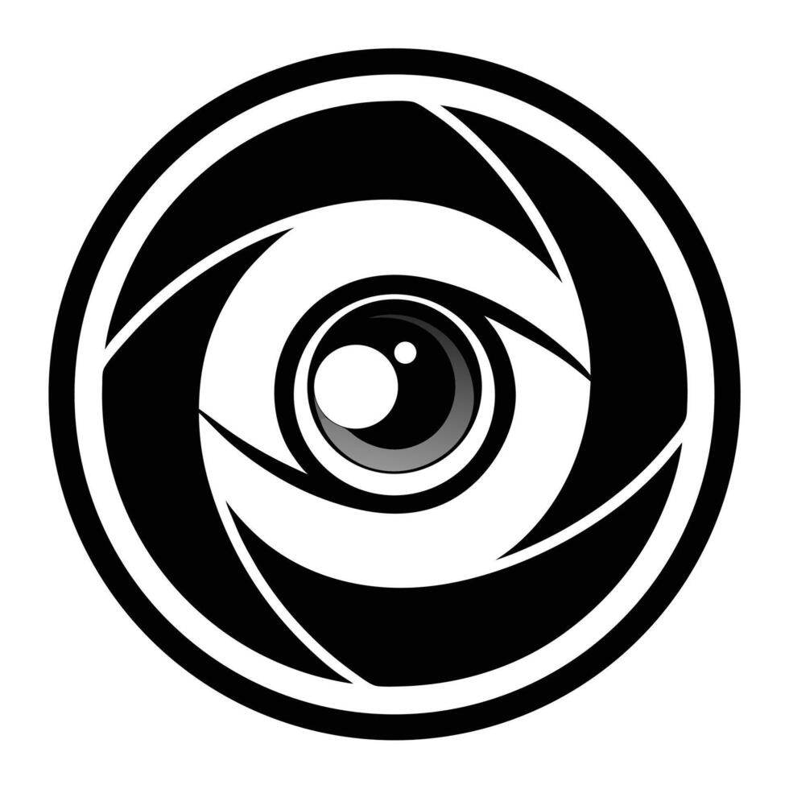

# Lensly

<p align="center">
  
</p>

## Core Stack

- **Monorepo:** Turborepo & Bun Workspaces — Efficient management of shared packages and apps with high-performance dependency resolution.
- **Web App:** Next.js (App Router) — Modern React framework optimized for performance, SEO, and developer productivity.
- **Database & ORM:** Mongoose + MongoDB — Flexible, document-based database with a powerful, schema-based modeling tool.
- **Authentication:** Better Auth — A comprehensive authentication framework designed for safety and ease of integration.
- **Communication:** Elysia + Eden Treaty — High-performance, Bun-native RPC for seamless, end-to-end type safety between services.
- **API Documentation:** OpenAPI & Scalar — Automatically generated API schema and a beautiful developer-friendly reference UI.
- **State Management:** TanStack Query & nuqs — Robust server-state synchronization and type-safe URL search params.
- **Validation:** Zod & TypeBox — Schema-first validation for runtime safety, frontend forms, and backend API contracts.
- **UI & Styling:** Tailwind CSS & shadcn/ui — Utility-first styling with high-quality, accessible component primitives.
- **Linting & Formatting:** Biome — Ultra-fast, unified toolchain for maintaining code quality and consistent formatting.

## Project Structure

```text
.
├── apps/
│   └── web/                     # Next.js App Router (Dashboard & API)
├── packages/
│   ├── api/                     # Elysia API (End-to-end type-safety bridge)
│   ├── auth/                    # Better Auth (Authentication logic)
│   ├── db/                      # Mongoose + MongoDB (Database layer)
│   ├── types/                   # Shared TypeScript interfaces
│   ├── ui/                      # Shared UI system (Tailwind & Components)
│   ├── validators/              # Common Zod schemas
│   ├── utils/                   # Shared helper functions
│   └── assets/                  # Shared images and icons
├── docker-compose.yml           # Local MongoDB container setup
└── package.json                 # Monorepo root & scripts
```

## Setup

### Prerequisites
- [Bun](https://bun.sh/) (latest version)
- Node.js (v20+ recommended)
- [Docker Desktop](https://www.docker.com/products/docker-desktop/) (for local MongoDB)

### 1. Installation & Initial Setup

Clone the repository and install dependencies:

```bash
git clone https://github.com/karume-lab/lensly.git
cd lensly
bun install
```

### 2. Local Infrastructure (Database)

Lensly uses Docker Compose to easily spin up a local MongoDB instance. Start the database in the background:

```bash
docker-compose up -d
```

This will expose a MongoDB instance on `localhost:27017` with a database named `lensly`.

### 3. Environment Variables

Copy the `.env.example` files to `.env` in the root directory and the web app directory:

```bash
cp .env.example .env
cp apps/web/.env.example apps/web/.env
```

Ensure your `MONGODB_URI` in the `.env` file is set to point to your local Docker container:
`MONGODB_URI=mongodb://localhost:27017/lensly`

### 4. Database Initialization

Because Lensly uses MongoDB via Mongoose (a NoSQL document database), strict SQL-style migrations (like generating and applying SQL schema files) are not required. The collections are created automatically when documents are inserted. 

However, you still need to generate the auth schema for Better Auth and seed your initial data:

```bash
# Generate auth-related types and initial setup for Better Auth
bun db:generate-auth

# Seed the database with 50+ realistic users, jobs, and applicants
bun db:seed
```

The seed data is located in `packages/db/src/seed-data/` and is populated via the [main seeder](packages/db/src/seed.ts).

## Managing Database Changes (MongoDB / Mongoose)

Unlike SQL databases, Mongoose enforces structure at the application level rather than the database level. 

To add a new collection or modify an existing one:

1. **Define the Schema:** Create or update a file in `packages/db/src/schema/` (e.g., `feature.ts`).
2. **Export the Model:** Ensure the model is exported in `packages/db/src/schema/index.ts`.
3. **Update Types:** Add the inferred type to `packages/types/src/db.ts` to maintain type safety across the monorepo.
4. **Define API Contracts:** Update `packages/api/src/routers/types.ts` with the corresponding TypeBox schema for your API responses.

You do not need to run migration scripts. Mongoose will seamlessly adopt the new schema definitions upon restarting the development server.

## Usage

### Development

Start all dev servers in parallel from the root directory:

```bash
bun dev
```

Or run individual apps:

```bash
# Web only (Next.js)
bun dev:web
```

### API Documentation

The API documentation is automatically generated from your Elysia routes using the Swagger plugin. Lensly uses Scalar for a beautiful, interactive documentation experience.

- **OpenAPI Schema:** `http://localhost:3000/api/openapi.json`
- **Interactive Reference:** `http://localhost:3000/docs/api/reference`

### Adding New Features

#### New API Procedure
1. Define your strict TypeBox response schemas in `packages/api/src/routers/types.ts`.
2. Implement the procedure in `packages/api/src/routers/`.
3. Export the new router in `packages/api/src/routers/index.ts`.
4. The type-safe client will be automatically available to the `web` app via the Eden Treaty client (`api`).

#### New UI Component
To add a new shadcn/ui component to the shared UI package:
```bash
bun ui:web [component-name]
```

### Code Quality

Run checks across the entire monorepo:

```bash
# Format and lint fix all apps and packages
bun clean

# Run linter checks
bun lint

# Run type checks
bun typecheck
```

## Available Scripts

| Script | Description |
| :--- | :--- |
| `bun dev` | Start all apps in watch mode |
| `bun build` | Build all apps and packages |
| `bun start` | Start all apps for production |
| `bun lint` | Lint all apps and packages |
| `bun typecheck` | Typecheck all apps and packages |
| `bun clean` | Fix linting/formatting issues across the repo |
| **Web App** | |
| `bun dev:web` | Start Next.js development server |
| `bun build:web` | Build Next.js for production |
| `bun start:web` | Start Next.js production server |
| `bun lint:web` | Lint web app |
| **Database & Auth** | |
| `bun db:seed` | Seed the database |
| `bun db:generate-auth` | Generate Better Auth schema |

## Contributing

Contributions are welcome. Please read our `CONTRIBUTING.md` and `CODE_OF_CONDUCT.md` before getting started.

1.  **Create a Branch**: Create a new branch for your changes (`git checkout -b feature/[FEATURE_NAME]`).
2.  **Make Changes**: Implement your changes and ensure they follow the project's coding standards.
3.  **Run Tests**: Ensure all tests pass (`bun lint` and `bun typecheck`).
4.  **Submit a Pull Request**: Submit a pull request to the main repository.
